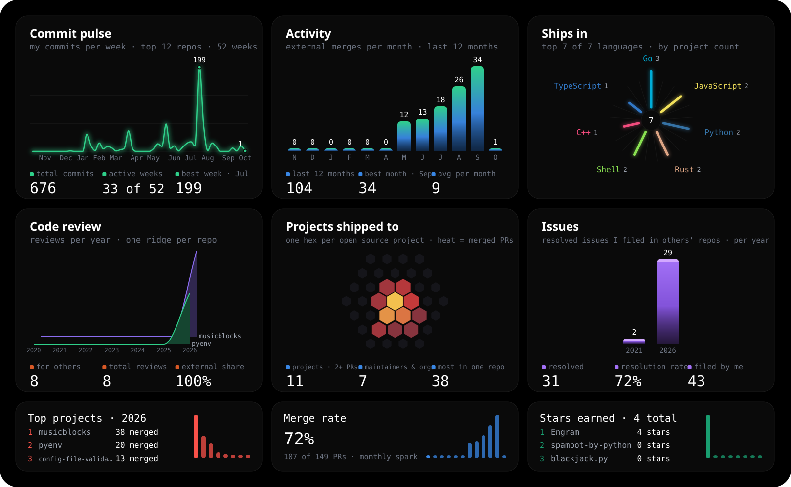

<table width="100%">
<tr>
<td align="left"><strong>CS student / developer.</strong> Building tools for AI, data, and the web.</td>
<td align="right"><a href="https://ayushh.in">Portfolio</a> · <a href="https://www.linkedin.com/in/anayush14/">LinkedIn</a> · <a href="mailto:ayushhoff@gmail.com">Email</a></td>
</tr>
</table>

Currently building **[Cutscene](https://github.com/macayu17/Cutscene)**.

### Projects

- **[Engram](https://github.com/macayu17/Engram)**: a self-hosted memory layer that keeps context in sync across LLM clients. [Demo](https://engram.ayushh.in/)
- **[SENTINEL](https://github.com/macayu17/SENTINEL)**: a market simulator with live order-book analytics. [Demo](https://sentinel.ayushh.in/)
- **[Cutscene](https://github.com/macayu17/Cutscene)**: a local-first screen recorder that uses UI structure for automatic zooms and interactive demos. [Demo](https://cutscene-editor-sandy.vercel.app/demo)
- **[EquityFlow](https://github.com/macayu17/Equityflow)**: a paper-trading platform for stocks, futures, and commodities. [Demo](https://equityflow.ayushh.in/)
- **[PRISM](https://github.com/macayu17/PRISM)**: text-based Parkinson's screening using transformer models and ensemble learning.
- **[Occasio](https://github.com/macayu17/Occasio)**: an event platform for bookings, QR tickets, and check-in. [Demo](https://occasio.ayushh.in/)

### Open Source

- Authored **[100+ merged GitHub PRs](https://github.com/search?q=author%3Amacayu17+is%3Apr+is%3Amerged&type=pullrequests)** across projects including Sugar Labs, pyenv, OpenTelemetry, and NASA.
- Contributed to [CDLI](https://gitlab.com/cdli) on GitLab, improving repository tooling and data workflows.

### Tech Stack

